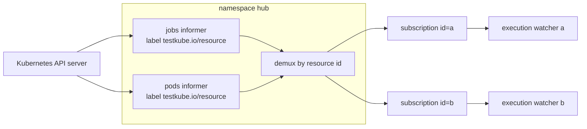
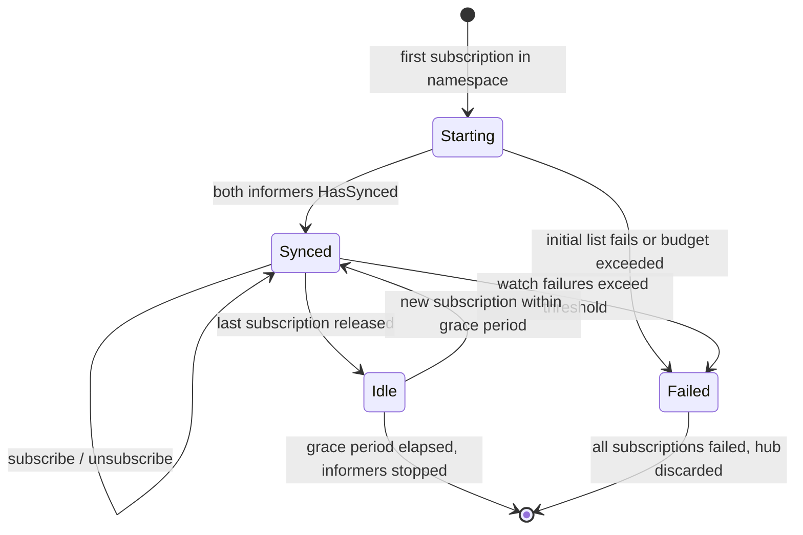

# Shared per-namespace execution watchers

Status: design, not implemented. This document describes the target shape for execution monitoring
so that Kubernetes watch cost scales with the number of watched namespaces instead of the number of
concurrent executions. It is the reviewable step before any code lands; the implementation is
expected to arrive behind a default-off toggle and to keep the current transport as the fallback.

Everything described under "Current behavior" was read out of the source at the time of writing and
is stated with the symbol it comes from, so a reviewer can disagree with a concrete claim rather
than with a summary.

## Current behavior

### Per-execution stream inventory

`NewExecutionWatcher` in
[`pkg/testworkflows/executionworker/controller/watchers/executionwatcher.go`](../pkg/testworkflows/executionworker/controller/watchers/executionwatcher.go)
opens four independent list-and-watch cycles per execution, all in the execution's namespace:

| Stream | Resource | Selector | Constructor |
|--------|----------|----------|-------------|
| job | `batch/v1` Jobs | `FieldSelector: metadata.name=<id>` | `NewJobWatcher` |
| pod | `v1` Pods | `LabelSelector: testkube.io/resource=<id>` | `NewPodWatcher` |
| job events | `v1` Events | `FieldSelector: involvedObject.name=<id>`, kind `Job` | `NewEventsWatcher` |
| pod events | `v1` Events | `FieldSelector: involvedObject.name=<podName>`, kind `Pod` | `NewAsyncEventsWatcher` |

Each cycle performs one LIST and then holds a WATCH that is re-established in a loop for as long as
watching returns no error (`cycle` in `job_watcher.go`, `pod_watcher.go`, `events_watcher.go`). The
default watch timeout is `defaultWatchTimeoutSeconds`, which is 365 days, so the streams are
effectively permanent for the lifetime of the execution. The pod events stream is created up front
but stays parked in `waitForOpts` until the pod name is known, so it becomes a real stream only once
a pod exists.

The counted cost at N concurrent executions in one namespace is therefore about 4N permanent watch
streams and 4N initial lists, from a single service account that shares one API Priority and
Fairness flow.

### Additional list traffic while an execution runs

`WatchInstrumentedPod` in
[`pkg/testworkflows/executionworker/controller/watchinstrumentedpod.go`](../pkg/testworkflows/executionworker/controller/watchinstrumentedpod.go)
waits for completion in a select that also has a `ForceFinalizationDelay` timer of 30 seconds. Every
time that timer wins, it calls `RefreshPod` and `RefreshJob`, which call `Update` on the pod and job
watchers, and each `Update` runs the full `read` path, which is another LIST. A long-running
execution that emits no pod or job updates therefore contributes two lists per 30 seconds for its
whole duration.

Two related observations, because they change the expected size of the improvement:

- `read` builds a local copy of the list options, clears its resource version and sets a list
  timeout, and then passes the stored `e.opts` to `List` instead of the copy. The refresh lists
  consequently carry the last observed resource version, which the API server may serve from its
  watch cache, and they do not carry the intended 240 second timeout. This is a pre-existing
  inconsistency, not something the hub introduces, and it means the refresh lists are cheaper than a
  quorum read while still serializing every matching object.
- `EventsWatcher.Update` and `EventsWatcher.Ensure` have no callers outside the package. The event
  streams do exactly one list each and then only watch, so they contribute no recurring list load.

### The transport seam

The watchers are already decoupled from the state machine. Each one takes a
`kubernetesClient[T, U]` from
[`watchers/commons.go`](../pkg/testworkflows/executionworker/controller/watchers/commons.go):

```go
type kubernetesClient[T any, U any] interface {
	List(ctx context.Context, options metav1.ListOptions) (*T, error)
	Watch(ctx context.Context, options metav1.ListOptions) (watch.Interface, error)
}
```

and pushes objects into a `store.Value[T]` through a plain `listener func(*T)`. Nothing above the
listener knows how the object arrived. The execution state machine, the notifier, the controller and
the execution worker are unaffected by a transport change, which is why the change is worth staging
at all.

## Confirmed label guarantees

`AnnotateControlledBy` in
[`pkg/testworkflows/testworkflowprocessor/utils.go`](../pkg/testworkflows/testworkflowprocessor/utils.go)
sets `testkube.io/resource` (`constants.ResourceIdLabelName`) and `testkube.io/root`
(`constants.RootResourceIdLabelName`) on the object it is given, and recurses into `Spec.Template`
when the object is a Job. In `processor.go` it is applied to the pod template
(`AnnotateControlledBy(&podSpec, ...)`) and to the Job (`AnnotateControlledBy(&jobSpec, ...)`), and
the same two labels are also appended to the pod config through `layer.AppendPodConfig`. Both calls
happen after user-supplied job and pod labels are assigned, so a workflow cannot shadow either
label.

Where the guarantee holds:

- Regular executions. `worker.Execute` builds the bundle through `processor.Bundle`, so the Job
  carries the labels on its own metadata and on its pod template, and the pod inherits the template
  labels.
- Services. `worker.Service` uses the same `processor.Bundle` call and only patches the restart
  policy, backoff limit and readiness probe afterwards. The labels are untouched.
- Parallel steps. The toolkit spawns them through `spawn.ParallelExecutionWorker(cfg).Execute(...)`,
  which is the same `worker.Execute` path in-process inside the toolkit container.

So every Job and Pod that an execution watcher can be asked to monitor is selectable by a
label-presence selector on `testkube.io/resource`. The label-value equivalence for jobs also holds:
the Job name is `options.Config.Resource.Id`, which is exactly the value stamped into the label, so
selecting jobs by label and selecting them by `metadata.name` return the same object.

Where the guarantee is thinner, and what the hub must do about it:

- The state machine reads the job's resource id from the pod template
  (`job.ResourceId()` returns `original.Spec.Template.Labels[ResourceIdLabelName]`) while the pod
  reads it from its own metadata (`pod.ResourceId()`). A server-side selector can only filter on the
  object's own labels. The hub therefore filters jobs on job metadata but keys them by the pod
  template label, matching `job.ResourceId()` exactly, and treats a job whose template label is
  missing as unroutable rather than guessing.
- `testkube.io/runner` is stamped only when a runner id is configured, and the controller
  deliberately depends on being able to see resources that belong to a different runner: `New` in
  `controller.go` returns `ErrJobDifferentRunner` after reading `watcher.State().RunnerId()` from the
  job or pod labels. The hub must not narrow its selector by runner id. Doing so would turn "owned
  by another runner" into "not found", which the caller reports as `ErrJobTimeout`.
- Services created with a restart policy other than `Never` get `BackoffLimit` reset to nil, so the
  Job may create a replacement pod. Two pods can then carry the same resource id at once, one
  terminating and one new. Today `podWatcher.read` fails hard in that case with "found more than one
  pod for selected criteria" and cancels the watcher. This is pre-existing behavior; the hub must
  reproduce it rather than silently picking one pod, otherwise the flag changes results instead of
  changing transport.

No missing-label gap was found, so this is not grounds to re-scope. The two behavioral constraints
above are.

## Target shape

### The hub

One hub per (client set, namespace) pair, owning exactly two shared informers:

- Jobs in the namespace, filtered server-side by the label-presence selector `testkube.io/resource`.
- Pods in the namespace, filtered by the same selector.

Both informers use no resync period, an added index keyed by the resource id (pod template label for
jobs, metadata label for pods) so that demultiplexing is a store lookup rather than a scan, and a
transform that clears managed fields. Nothing in the execution state machine reads
`metadata.managedFields`, and the field is a large fraction of a serialized pod. The rest of the
object has to stay: `GetPodError` reads `Spec.ActiveDeadlineSeconds`, `pod.NodeName` reads
`Spec.NodeName` and `Status.NominatedNodeName`, and the execution's signature, action groups and
internal config are read out of pod annotations.

Because the label-presence selector matches only Testkube execution resources, the informer cache
does not grow with unrelated workloads in the namespace, unlike the trigger service informers.

### Subscriptions and demultiplexing

A subscription is created per execution id and satisfies the same contract the raw watchers satisfy
today: it drives a `listener func(*T)` and exposes `Started()`, `Done()`, `Err()` and a refresh
entry point. The hub keeps a set of subscriptions per resource id and, on every informer event,
routes the object to the subscriptions registered for the id carried by that object.



Two delivery details are not optional:

- Objects handed to a subscription are deep copies. The raw watchers mutate what they receive:
  `pod_watcher.go` and `job_watcher.go` both set `DeletionTimestamp` on a delete event when the
  cluster did not set one. Applying that to an object owned by a shared informer cache would be a
  data race and would corrupt what every other subscriber sees.
- Deletions arrive either as the object or as a `cache.DeletedFinalStateUnknown` tombstone. The hub
  unwraps the tombstone and synthesizes the deletion timestamp with the same helpers the raw
  watchers use (`GetPodLastTimestamp`, `GetJobLastTimestamp`), so the state machine sees identical
  input.

A subscription terminates itself on the same condition the raw watcher does: once `IsPodFinished` or
`IsJobFinished` holds for its own object, the subscription is done with cause `ErrDone` while the hub
informer keeps running for everyone else.

### Initial-state semantics

This is the part that must not regress. `NewExecutionWatcher` blocks on `<-watcher.baseStarted()`
before the first `Commit`, and `Started()` unblocks only after that first commit. `controller.New`
then does:

```go
if watcher.State().Job() == nil && watcher.State().Pod() == nil && watcher.State().CompletionTimestamp().IsZero() {
	if !watcher.State().JobEvents().FirstTimestamp().IsZero() || !watcher.State().PodEvents().FirstTimestamp().IsZero() {
		return nil, ErrJobAborted
	}
	return nil, ErrJobTimeout
}
```

So the distinction between "not started yet" and "already gone" is not made by the job and pod
streams at all. Both cases look the same to them: an empty initial read. The disambiguation comes
from the event streams, which still hold traces of a job that no longer exists. The `existed` flag
inside the job and pod watchers only serves the narrower case where the object was observed by that
same watcher and then disappeared, which is a mid-life deletion rather than a connect-time question.

The hub therefore has to guarantee exactly one thing at subscription time: a synchronous, truthful
answer to "does the store hold a job or a pod for this id", where truthful means "not merely
unsynced". The rules:

1. `Subscribe` registers the subscription before reading the store, so no event can be missed
   between the read and the registration.
2. The subscription's `Started()` closes only after both informers report `HasSynced` and after the
   initial replay of matching objects from the store has been pushed to the listener. A subscription
   that arrives while an informer is still doing its initial list waits; it never observes an empty
   store as "nothing exists".
3. If the store holds nothing for the id once synced, the subscription performs one targeted GET of
   the job by name before declaring emptiness, and a label-selected list of pods only if that GET
   found a job while the pod store did not. This covers the known window where a just-created Job is
   not yet visible through this particular cache, which `summaryWithJobRetry` in
   [`pkg/runner/agent.go`](../pkg/runner/agent.go) already has to retry around today. One GET per
   subscription replaces the two lists per execution that exist now.
4. Hub startup is bounded. If the informers do not sync within a startup budget, subscriptions fail
   with the sync error rather than reporting an empty state, and the caller sees an error instead of
   a wrong `ErrJobTimeout`.



### Refresh semantics

`RefreshPod` and `RefreshJob` keep their signatures and their meaning, "make sure I am not missing
state right now", but stop being lists:

- Default case: re-read the id from the informer store and re-emit to the listener. No API call.
- Critical gap: the paths in `executionwatcher.go` that set `hasMissingCriticalPod` or
  `hasMissingCriticalJob`, meaning the event stream reported an error or the job reported success
  while the pod is not finished. Here the subscription issues a targeted single-object GET, a job by
  name or a pod by name, and feeds the result through the same listener. This is the escape hatch
  that keeps result correctness independent of cache freshness.
- Critical gap with no pod name yet: `hasMissingCriticalPod` can hold while the subscription has
  never observed a pod, so there is no name to GET. A pod name is not a precondition the design may
  assume. The authoritative lookup in that case is a label-selected list of pods for the resource id,
  the same request the current pod watcher issues, scoped to the one execution and reached only on
  this path. If it returns nothing the execution is genuinely gone and the state machine sees the
  same empty result it sees today; if it returns more than one pod, that stays the error it is now
  rather than becoming a silent pick. Without this fallback a terminal state that arrives before the
  pod is known has no authoritative source, which is exactly how an execution gets stranded or
  misreported.

### Failure propagation

Today each watcher owns a `context.WithCancelCause`; `Done()` is that context's `Done()` and `Err()`
is its `Err()`. Because `Err()` on a cancelled context reports `context.Canceled` rather than the
cause, the current API already conflates "the stream ended because the resource reached a terminal
state" with "the stream failed", and `controller.PodIP` and `controller.NodeName` treat any non-nil
`PodErr()` as a reason to fail the call. Teardown is `StopController`, which cancels the controller
context, which cancels every watcher context.

The subscriber-scoped equivalent keeps that shape rather than improving on it:

- Each subscription owns a `context.WithCancelCause` derived from the subscriber's context, and
  exposes `Done()` and `Err()` from it. Cancellation causes are subscriber teardown, terminal state
  of its own resource (`ErrDone`), and hub failure.
- Hub failure fails all subscriptions. Shared informers do not surface failures on their own: a
  reflector whose watch keeps failing retries forever and only logs. The hub therefore installs a
  watch error handler on both informers and treats a failure to sync before the startup budget, or a
  run of consecutive watch errors past a threshold, as hub failure. It then cancels every
  subscription with that cause and removes itself from the registry, so the next subscription builds
  a fresh hub.
- A subscription that outlives its hub is not silently starved. That is the property the whole design
  turns on: the current code cannot silently starve, because a broken stream cancels one execution's
  watcher, and the shared version must fail loudly in the same way for all of them.

### Hub lifecycle

Hubs live in a registry keyed by namespace with reference counting, which mirrors the existing
`controllersRegistry` in
[`pkg/testworkflows/executionworker/registry/controllers.go`](../pkg/testworkflows/executionworker/registry/controllers.go):
reservations counted on acquire, released through a `recycle` closure, and teardown deferred by a
grace period so that a caller reconnecting immediately reuses the live instance.

- Created on the first subscription for a namespace, together with its two informers.
- Reference counted per subscription. Releasing the last subscription starts an idle timer rather
  than stopping the informers.
- Stopped when the idle timer expires with no new subscription, so short-lived namespaces do not leak
  informers. The idle window is longer than the controller registry's one second deregister delay,
  because rebuilding a hub costs two full lists; a few minutes is the right order.
- Recreated transparently on the next subscription after teardown or failure.

### Why events stay on per-execution watchers

Events keep the transport they have today, for four reasons that are independent of each other:

1. Events cannot be label-selected. Nothing stamps Testkube labels on the Event objects the
   kubelet and the job controller produce, and the only usable narrowing is
   `involvedObject.name`.
2. A namespace-wide event informer is the exact failure mode being fixed. The reported throttling
   includes `failed to list *v1.Event: the server is currently unable to handle the request`, which
   comes from the trigger service's namespace-wide core event informer.
3. The event streams are the cheapest of the four. They do exactly one list each and then watch, with
   no recurring refresh, because `Update` and `Ensure` have no callers.
4. Connect-time correctness depends on them. As shown above, `ErrJobAborted` versus `ErrJobTimeout`
   is decided by event traces, not by the job and pod streams, so the event transport is the one
   place where a cache miss would change a result rather than delay it.

Revisiting this is a data question, not a design question: it needs the request-rate metrics to show
that per-execution event watches are actually a meaningful share of the load.

## Multi-runner and multi-process coexistence

Hubs are per process, not per cluster, and no coordination between them is introduced.

- Two runner replicas watching the same namespace each build their own hub, so the namespace carries
  four streams instead of two. That is still strictly fewer than the 4N per replica they hold today.
- Both replicas see all labeled objects in the namespace, including executions owned by the other
  replica. That is required, not incidental: it is how `ErrJobDifferentRunner` is produced.
- The toolkit also constructs execution workers, one per parallel configuration
  (`spawn.ParallelExecutionWorker`), inside the workflow's own pod. A hub there is scoped to that
  short-lived process and covers only that workflow's services and parallel workers, so its two
  informers replace a smaller number of streams. The reference counting and idle teardown matter
  more in that context than in the runner, since the process may only ever monitor one child.
- An agent and a runner sharing a namespace behave like two runner replicas.

## Measurement plan

The comparison uses the client-go REST metrics added by the instrumentation change that precedes
this work: `testkube_k8s_client_requests_total{code,method}`,
`testkube_k8s_client_request_duration_seconds{verb}` and
`testkube_k8s_client_rate_limiter_duration_seconds{verb}`.

Procedure: hold a fixed concurrency of long-running workflows in a fixed number of watched
namespaces, let the system settle, and record the same window with the toggle off and on.

What to record and what to expect at N concurrent executions across M namespaces:

| Quantity | Toggle off | Toggle on |
|----------|-----------|-----------|
| Permanent watch streams for execution monitoring | about 4N | 2M plus 2N (event streams) |
| Initial lists per execution | 4 | 2 (events only) |
| Targeted GETs per execution | 0 | at most 1 at subscribe, plus critical-gap reads |
| Recurring lists while idle | 2 per execution per 30s | none |
| Informer caches | none | 2 per namespace, holding the namespace's labeled jobs and pods |

Concretely, with three namespaces and thirty concurrent executions in each: about 360 permanent
watch streams today against about 186 with the hub, and the recurring list load from
`ForceFinalizationDelay` refreshes, roughly 180 lists per minute at that concurrency, drops to zero.
The counter to watch for a regression is `testkube_k8s_client_requests_total{method="GET"}`, which
should rise by no more than one per execution plus critical-gap reads.

Secondary signals: resident memory of the runner process, since informer caches are new memory that
scales with retained labeled objects per namespace rather than with live executions, and the rate
limiter duration histogram, which shows whether client-side queuing disappears.

## Residual risks

- Correctness over throughput. This machinery decides whether an execution is finished and whether
  it passed. A missed pod terminal state can wedge or mis-report an execution. Mitigations in the
  design: default-off toggle, unchanged fallback transport, terminal-state detection kept in the
  state machine rather than in the transport, and targeted GETs on the critical-gap paths.
- Cache staleness at connect time. Reading a shared cache is not the same as issuing a fresh list.
  The mitigation is the targeted GET before declaring emptiness, which is also the point where a
  mistake would show up as a spurious `ErrJobTimeout`.
- Memory. Informer caches retain every labeled job and pod in the namespace, including completed ones
  that have not been cleaned up, and pod annotations carry the serialized signature and action
  groups. Managed fields are stripped; the rest cannot be. Memory becomes a function of namespace
  retention rather than of live concurrency, which is a different failure mode from the one being
  fixed.
- Shared failure domain. One broken namespace informer affects every execution in that namespace
  rather than one. The watch error handler and the fail-all-subscriptions rule make this loud instead
  of silent, but the blast radius is genuinely larger.
- Duplicate pods per resource id. Pre-existing, and it stays an error rather than becoming a silent
  pick.

Grounds to re-scope rather than force the design:

- A resource type reaching the execution watcher without the resource id label, which would break
  server-side filtering. Not observed in the paths reviewed here.
- Any need to filter the hub selector by runner id, which would break `ErrJobDifferentRunner`.
- Measured GET traffic at subscribe time that approaches the list traffic it replaces, which would
  mean the cache is not actually authoritative at connect time and the design's central assumption is
  wrong.
- Informer cache memory that scales with namespace retention badly enough to matter in a real
  deployment, in which case the smaller change is to keep per-execution transport and reduce the
  stream count per execution instead.
