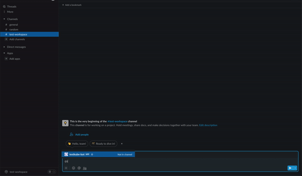

# Integrating with Slack

In order to receive notifications in slack about the status of the testing process, Testkube provides integration with slack, for this to work bellow are the steps to configure it.

## Install Testkube bot to your Slack Workspace

Teskube bot

## Add Testkube bot to a channel

## Configure Testkube to use the slack bot token

Populate slackToken in the helm values file, then install testkube using helm install, see [Manual Testkube Helm Charts Installation](installing.md) for more information.
