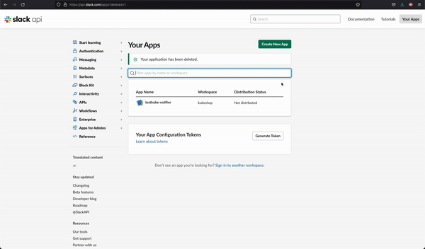

# Integrating with Slack

In order to receive notifications in slack about the status of the testing process, Testkube provides integration with slack, for this to work bellow are the steps to configure it.

## Create a slack bot for testkube

Go to [https://api.slack.com/apps](https://api.slack.com/apps) and create new app within your namespace, select app to be a Bot type, add within Review Scopes to Add, add chat:write and chat:write.public then Install to Workspace and a bot token will be generated.

## Create a slack channel

Create a new slack channel or use a existing one and get the channel id that you can find in the Channel Details window at the bottom.

## Configure Testkube to use the bot token and channel

Populate slackToken and slackChannelId values in the helm values file to use the token and channel, then install testkube using helm install see [Installation](installing.md)
