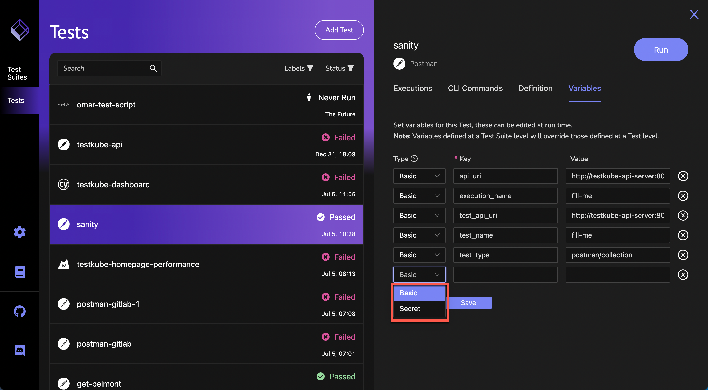

# Using Test Variables

To synchronize Testkube's feature set between the CLI and the UI, Test variables can be defined in the UI. On the Tests screen, select a Test and click on the **Variables** tab:

When the variables tab is opened, any variables already existing for that Test will be shown. To create a Test variable, click **Add Variable** and provide desired values.

The types available for Test variables are  Basic and Secret. 
